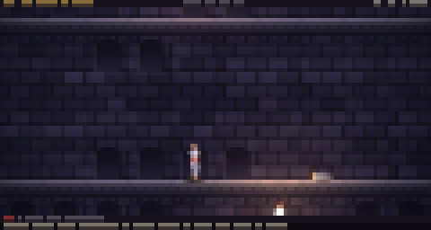
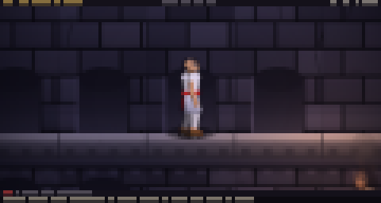
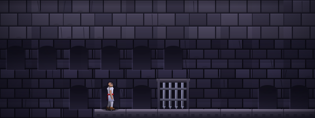
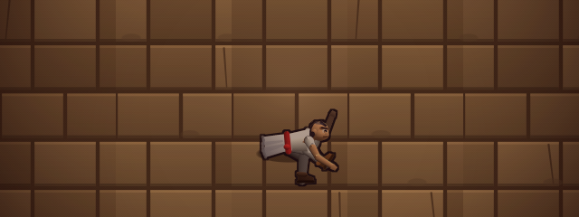
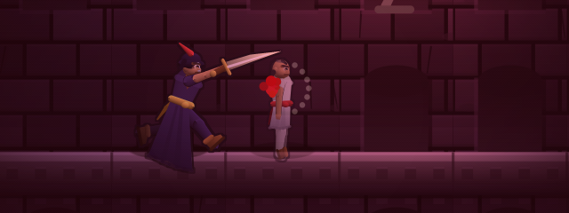
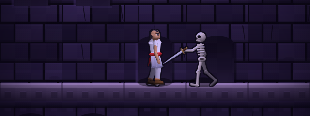

# Prince of Persia — édition terminal, en Rust

Une réécriture jouable de *Prince of Persia* qui tourne **dans une fenêtre de
commande**, écrite en Rust, avec des graphismes rendus en pleine couleur, cinq
armes (dont quatre bonus qui n'existaient pas dans l'original) et six niveaux
inédits, tous **plus longs que n'importe quel niveau du jeu de 1989**.



*Capture fidèle de ce que montre un terminal de 120 × 32 : chaque cellule de
caractère contient deux pixels indépendants.*



*La même scène, `+` enfoncé. Une salle entière dans 120 colonnes ne laisse au
prince que quatre pixels de large ; la vue rapprochée lui en donne douze, et le
dessin devient lisible. Voir [Une salle entière ou de près](#une-salle-entière-ou-de-près).*

---

## Sommaire

- [Lancer le jeu](#lancer-le-jeu)
- [Commandes](#commandes)
- [Une salle entière ou de près](#une-salle-entière-ou-de-près)
- [Fluidité](#fluidité)
- [Les armes](#les-armes)
- [Les six niveaux](#les-six-niveaux)
- [Comment les graphismes fonctionnent](#comment-les-graphismes-fonctionnent)
- [Écrire un niveau](#écrire-un-niveau)
- [Outils en ligne de commande](#outils-en-ligne-de-commande)
- [Architecture du code](#architecture-du-code)
- [Tests](#tests)
- [Origine](#origine)

---

## Lancer le jeu

```sh
cargo run --release          # démarre au menu
cargo run --release -- -l 4  # démarre directement au niveau 4
```

Une seule dépendance : [`crossterm`](https://crates.io/crates/crossterm), pour
le mode brut du terminal et la lecture du clavier. Tout le reste — rastériseur,
éclairage, animation, encodeur PNG — est écrit à la main dans ce dépôt.

**Ce qu'il faut au terminal :** la couleur 24 bits (« truecolor ») et une police
qui contient `▀` (U+2580). Autrement dit, à peu près tous les terminaux modernes.
Taille minimale 56 × 14 ; 120 × 32 ou plus est confortable.

> **Contrôle précis.** Un terminal ne signale traditionnellement que les
> *appuis*, jamais les relâchements, ce qui est gênant pour « est-ce que la
> touche course est toujours enfoncée ? ». Là où le protocole clavier étendu de
> Kitty est disponible (kitty, ghostty, WezTerm, foot, Alacritty et Windows
> Terminal récents), le jeu l'active et le contrôle est exact. Ailleurs, un appui
> maintient l'action vivante pendant 420 ms et chaque répétition automatique la
> prolonge ; dans ce mode, **Maj + direction** — un pas court et précis qui
> s'arrête au bord — est la façon sûre d'approcher un précipice ou une fosse à
> pointes. Le menu indique lequel des deux modes est actif.

## Commandes

| Touche | Effet |
|---|---|
| `←` `→` | courir |
| `Maj` + `←` `→` | pas prudent : avance d'un peu moins d'une demi-dalle et s'arrête au bord |
| `↑` | sauter sur place ; se hisser sur la corniche devant soi |
| course puis `↑` | saut en course : franchit trois dalles |
| `↓` | s'accroupir ; `Maj`+`↓` pour descendre en se suspendant |
| `↑` / `↓` suspendu | se hisser / lâcher prise |
| `Maj` en chute | rattraper la corniche — y compris celle qu'on vient de quitter |
| `+` `-` | rapprocher / éloigner la vue |
| `Espace` ou `X` | frapper (dégaine l'épée si nécessaire) |
| `Z` | parer |
| `T` | lancer une dague |
| `F` | bâton de flamme |
| `C` | rengainer — **indispensable face à l'Ombre** |
| `Tab` | changer d'arme de corps à corps |
| `P` / `Échap` | pause · `R` recommencer le niveau · `F1` aide · `Q` quitter |

`W` `A` `S` `D` doublent les flèches.

## Une salle entière ou de près

Un terminal de 120 colonnes affichant une salle complète de 10 dalles donne
0,375 pixel par pixel d'image : le prince y mesure **4 pixels de large sur 11 de
haut**. Aucun dessin ne survit à ça — ni le visage, ni les bras, ni les bottes.

Le jeu propose donc deux cadrages, `+` et `-` pour passer de l'un à l'autre :

| Vue | Cadrage | Taille du prince (120 colonnes) |
|---|---|---|
| **x1** (défaut) | une salle entière, comme l'original | 4 × 11 px |
| **x1,4 … x3** | la caméra suit le prince | jusqu'à 12 × 30 px |

La vue x1 reste le défaut parce que voir la salle entière fait partie du *design*
de Prince of Persia : on repère la herse, la fosse et le garde avant de s'élancer.
Mais quand le calcul montre que le personnage tomberait sous 16 pixels de haut, le
jeu le signale dans la barre de messages au début du niveau. La vue rapprochée ne
descend jamais sous cinq dalles visibles : au-delà on ne verrait plus sur quoi on
saute. Sur un terminal large (200 colonnes et plus) la vue x1 suffit déjà.

`--view <N>` choisit le cadrage au lancement, y compris pour les captures.

## Fluidité

- **Simulation à pas fixe, 120 Hz.** La physique avance toujours par pas de
  1/120 s, quel que soit le rythme d'affichage : l'arc d'un saut en course et la
  cadence d'une lame sont identiques d'une partie à l'autre, et le mouvement reste
  fluide même quand le terminal n'arrive pas à suivre le dessin. Les touches à
  déclenchement unique ne sont données qu'au premier pas d'une image, donc un appui
  reste une action quel que soit le nombre de pas.
- **Affichage adaptatif.** 60 images par seconde jusqu'à 5 000 cellules, 45
  jusqu'à 12 000, 30 au-delà — chaque image coûte des séquences d'échappement à
  peu près proportionnelles au nombre de cellules, et un très grand terminal est
  donc redessiné moins souvent plutôt que de saturer la liaison. Le mouvement ne
  change pas : c'est la simulation qui le porte.
- **Aucune transition ne coupe.** Le changement d'état gèle la pose qu'on quitte
  et la fond vers la nouvelle en 85 ms. Il n'y a plus un seul saut d'animation
  entre courir, déraper, sauter, se hisser ou dégainer.
- **Le cycle de course est piloté par la distance parcourue**, pas par le temps.
  Les pieds ne patinent donc jamais — ni à l'accélération, ni sous potion de
  célérité, ni contre un mur.
- **Le demi-tour est un mouvement.** L'orientation visible est interpolée et sa
  *magnitude* comprime la figure horizontalement : le prince passe par une pose
  de profil écrasé au lieu de se retourner d'un coup comme un miroir.
- **Les appuis sont mémorisés 180 ms.** Un saut demandé pendant un dérapage ou une
  réception part dès que l'animation le permet, au lieu d'être avalé — et un saut
  en attente écourte le dérapage.
- **Rattrapage de corniche.** Sortir d'un bord en courant puis presser `Maj`
  attrape le rebord qu'on vient de quitter, en se retournant pour lui faire face.

## Les armes

L'épée est celle de l'original ; les quatre autres sont des ajouts. Tout ce que
vous ramassez vous suit d'un niveau au suivant.

| Arme | Où | Ce qu'elle fait |
|---|---|---|
| **Épée** | niveau 1, corridor inférieur | 1 point de dégât, portée 25 px. Sans elle, vous ne pouvez que fuir. |
| **Dagues de jet** (`T`) | niveau 1, citerne sous les geôles | Projectile, 1 dégât, 5 par ramassage, 12 au maximum. Aucune parade possible contre elles. |
| **Bouclier** (passif) | niveau 2, chambre inondée | Pare tout seul 40 % des bottes reçues de face, et dévie complètement les projectiles. |
| **Bâton de flamme** (`F`) | niveau 4, laboratoire de l'alchimiste | Boule de feu, 2 dégâts, éclaire la pièce en vol. 8 charges. |
| **Cimeterre du Vizir** (`Tab`) | niveau 5, sous les jardins | 2 dégâts, portée 29 px, 35 % de chance de traverser une parade — mais la botte est 22 % plus lente. |

Les fioles : `♥` soin, élixir de vigueur (+1 cœur définitif), potion de plume
(annule les dégâts de chute), potion de célérité (+35 % de vitesse), et du poison
qui ressemble beaucoup aux autres.

Et comme dans l'original, **l'Ombre du niveau 6 ne se combat pas.** Rengainez
votre épée avec `C` et marchez vers elle.

## Les six niveaux

Un niveau de l'original comptait au maximum 24 salles de 10 × 3 dalles. Ici :

| # | Niveau | Salles | Salles jouables | Thème | Nouveauté |
|---|---|---|---|---|---|
| 1 | Les Geôles du Sultan | 8 × 4 = **32** | 24 | cachot | épée, dagues, herse à dalle |
| 2 | Les Citernes | 9 × 5 = **45** | 27 | citerne | lames à cadence, bouclier, herse minutée |
| 3 | L'Escalier du Palais | 10 × 5 = **50** | 30 | palais | geôlier au cimeterre, élixir de vigueur |
| 4 | La Tour de l'Alchimiste | 9 × 6 = **54** | 29 | tour | bâton de flamme, squelette |
| 5 | Les Jardins Suspendus | 11 × 5 = **55** | 29 | jardins | cimeterre du Vizir, longue traversée |
| 6 | Le Sanctuaire de Jaffar | 10 × 6 = **60** | 27 | sanctuaire | miroir, l'Ombre, Jaffar |

**166 salles jouables** au total. Chaque niveau est vérifié automatiquement :
un test parcourt la carte avec un modèle volontairement pessimiste des capacités
du prince et échoue si la sortie ou le moindre objet est inatteignable
(voir [Tests](#tests)).





## Comment les graphismes fonctionnent

Le terminal n'est pas une contrainte esthétique acceptée à contrecœur : c'est la
cible pour laquelle tout le pipeline est conçu.

**Deux pixels par cellule.** Chaque cellule affiche `▀` (demi-bloc supérieur) :
la couleur de premier plan peint la moitié haute, celle de fond la moitié basse.
Avec la couleur 24 bits, cela donne deux pixels carrés indépendants par
caractère — la meilleure fidélité qu'un terminal puisse offrir sans renoncer à
la couleur par pixel.

**Rendu suréchantillonné puis réduit.** La scène est dessinée dans un canevas
d'environ 640 × 300 pixels, puis réduite au nombre de pixels réellement
disponibles par un filtre boîte qui moyenne dans un espace *quasi linéaire*
(les carrés des composantes). Sans cette correction gamma, une image réduite de
640 à 120 colonnes devient terne et sale ; avec, elle reste nette et lumineuse.
Le résultat est un anticrénelage réel, pas du « graphisme de caractères ».

**Personnages articulés, pas des sprites.** Chaque personnage est un petit
squelette — bassin, torse, tête, deux bras, deux jambes — et les animations sont
des poses articulaires interpolées. C'est ce qui rend praticable d'avoir la
course, le saut, l'escalade, la suspension, la boisson, trois gardes d'escrime et
cinq morphologies (prince, garde, geôlier obèse, squelette, Jaffar en robe) qui
se ressemblent toutes.

**Éclairage de forme.** Une capsule remplie d'une seule couleur se lit comme une
pastille plate. Chaque membre est donc ombré *en travers* de son axe, comme un
cylindre éclairé d'une direction fixe ; chaque tête est ombrée comme une sphère ;
chaque pièce de tissu est un polygone à dégradé directionnel. C'est ce qui donne
du volume aux figures, et c'est ce qui survit à la réduction : à douze pixels de
haut il ne reste que la silhouette et la structure des valeurs — tunique claire,
peau moyenne, cheveux et bottes sombres — et elles restent justes.

Le reste est de la construction : bottes en talon-semelle-pointe, mains en coin,
manches à ourlet, encolure en V, tunique à ourlet ondulant dont le balancement
suit les jambes, écharpe avec son nœud et son pan qui traîne, cheveux en une seule
forme voulue plutôt qu'en amas de cercles, et un visage dont le sourcil fait plus
pour la lisibilité que n'importe quel modelé.

Chaque figure est peinte dans un calque de couverture séparé, la couverture est
dilatée d'un pixel ou deux, et l'anneau qui apparaît autour reçoit la couleur du
contour. C'est ce qui donne aux silhouettes leur lisibilité sur une brique
chargée — dessiner directement sur le canevas mettrait des contours *entre* les
membres. Les membres du côté opposé sont en plus assombris, désaturés et refroidis,
de sorte que les membres proches avancent sans qu'il faille un trait entre eux.



**Éclairage en une passe.** La scène est d'abord peinte à pleine luminosité,
puis multipliée par un champ lumineux échantillonné bilinéairement (torches avec
scintillement à deux octaves de bruit, lucarnes, portes ouvertes, boules de feu
en vol). Comme la multiplication s'applique après coup, la lumière d'une torche
tombe automatiquement sur le sol, les murs, le prince et les gardes. Les
émetteurs — flammes, étincelles, éclats — sont ensuite ajoutés en additif, donc
eux ne s'assombrissent pas.

**Décor procédural.** Briques, joints, fissures, taches, niches en arc, corniches
à denticules, dalles, colonnes cannelées, herses à fers de lance, fosses à
pointes, lames, dalles de pression, torches, miroirs, lucarnes et portes de
sortie sont tous générés à partir des coordonnées de la dalle. Un mur donné a
toujours les mêmes briques, mais aucun mur ne ressemble à un autre.

**Bande passante.** Un scintillement de torche décale d'une unité ou deux la
couleur de presque toutes les cellules à chaque image ; les renvoyer toutes
coûterait des mégaoctets par seconde pour rien. Les cellules dont la différence
est imperceptible (≤ 3 par canal) sont laissées telles quelles, et une bande de
lignes tournante est repeinte inconditionnellement pour qu'aucune dérive ne
s'installe. Mesuré sur cette machine :

| Terminal | Canevas | ms / image | Images/s visées | Sortie |
|---|---|---|---|---|
| 100 × 30 | 640 × 345 | 13,8 | 60 | 0,9 Mo/s |
| 120 × 32 | 640 × 309 | 12,2 | 60 | 1,1 Mo/s |
| 200 × 50 | 640 × 300 | 12,5 | 45 | 2,2 Mo/s |
| 280 × 70 | 640 × 306 | 13,7 | 30 | 2,7 Mo/s |

Douze à quatorze millisecondes par image laissent la marge nécessaire pour tenir
60 images par seconde sur un terminal courant.
`cargo test --release --test bench -- --nocapture` refait la mesure.

## Écrire un niveau

Les cartes sont écrites en texte, par **fragments d'une salle** de dix
caractères — la grille de salles est ainsi visible dans le source et une ligne
mal comptée devient une erreur évidente au lieu d'un niveau subtilement cassé.

```rust
const L1_ROWS: &[&[&str]] = &[
    &[W, W, W, W, W, W, W, W],
    &[W, "....t.....", S, "......t...", S, "#####t....", "....t.....", "...#######"],
    &[W, F, "====g=====", "===^^=====", "=b======H#", "#####p=h==", F, "===X######"],
    //         ^ garde       ^ pointes    ^ dalle branlante   ^ dalle    ^ sortie
];
```

Alphabet des dalles :

```
  .  vide          =  sol            #  roche/mur       |  colonne
  b  dalle molle   :  gravats        ^  pointes         V  lames
  G  herse         p  dalle (lever)  o  dalle (baisser) X  sortie
  t  torche        m  miroir         w  lucarne         A  arc      n  ossements
  @  départ
  h  soin   H  vigueur   f  plume   x  poison   q  célérité
  s  épée   D  dagues    F  bâton   C  bouclier M  cimeterre
  g  garde  z  geôlier   k  squelette  S  ombre  J  Jaffar
```

Une seconde couche, alignée sur la première, câble les mécanismes : un chiffre ou
une lettre relie une dalle de pression aux herses et portes qui partagent le même
symbole. **Les groupes en minuscule ou en chiffre sont minutés** — la herse
redescend lentement — tandis que **les groupes en majuscule restent ouverts pour
de bon**. Sur un garde, un chiffre donne son adresse (0–9), qui détermine à
quelle fréquence il porte une botte, avec quelle fiabilité il pare et sa vitesse
de réaction : les trois mêmes réglages que l'original.

## Outils en ligne de commande

```sh
pop --validate                 # analyse les six niveaux : parsing + accessibilité
pop --map 3                    # carte ASCII, cellules atteignables marquées
pop --shot vue.png --level 6 --at 84,2      # capture PNG en pleine résolution
pop --tty-shot term.png --cells 120x32      # capture telle que l'affiche un terminal
pop --shot pose.png --pose strike --view 3 --size 640x240   # inspecter une pose
pop --view 2 --level 5         # jouer en vue rapprochée
pop --help
```

`--validate` sort avec un code non nul si un niveau est cassé, ce qui en fait un
contrôle utilisable en intégration continue. `--shot` et `--tty-shot` écrivent de
vrais PNG via l'encodeur maison (`src/gfx/png.rs`), compresseur deflate inclus.

## Architecture du code

```
src/
  util.rs            vecteurs, interpolations, RNG déterministe, hachage stable
  gfx/
    color.rs         couleur 24 bits, accumulateur à correction gamma
    target.rs        primitives anticrénelées + éclairage de forme (cylindre, sphère)
    canvas.rs        canevas de scène, champ lumineux, vignette, tramage, réduction
    layer.rs         calque de couverture pour les silhouettes contournées
    particles.rs     poussière, sang, gravats, étincelles, flammes, fumée
    term.rs          grille de cellules, rendu demi-bloc, écriture différentielle
    png.rs           encodeur PNG sans dépendance (deflate compris)
  art/
    skel.rs          squelette, cinématique directe, dessin des figures
    anim.rs          bibliothèque d'animations (poses articulaires clés)
    tiles.rs         décor procédural, sources de lumière, passe émissive
    items.rs         fioles, armes au sol, projectiles, effets
    theme.rs         six palettes de niveau
  world/
    tile.rs          vocabulaire des dalles, constantes métriques du monde
    level.rs         structure de niveau, analyseur des cartes ASCII
    levels.rs        les six niveaux
    dynamics.rs      état animé par cellule (herses, pointes, lames, dalles)
    reach.rs         vérificateur d'accessibilité
  game/
    mod.rs           état de jeu, pas de simulation, mécanismes, caméra
    player.rs        machine à états du prince, fondu de poses, allure, mémoire
    guard.rs         intelligence des gardes, escrime
    combat.rs        armes, projectiles, résolution des dégâts
    render.rs        composition de la scène
    hud.rs           affichage tête haute
  input.rs           clavier, protocole étendu et repli par maintien
  app.rs             boucle à pas fixe, cadence adaptative, cadrage, menus
```

### Géométrie du monde

Une dalle mesure 32 × 40 pixels d'art ; une salle fait 10 × 3 dalles, exactement
comme dans l'original. La surface sur laquelle on marche se trouve
[`FLOOR_H`] = 9 px au-dessus du bas de la cellule : la dalle de sol occupe le bas
de sa *propre* cellule, ce qui garantit que les trois surfaces d'une salle sont
dans le rectangle de la salle — indispensable puisque la caméra cadre exactement
une salle à la fois. Une cellule reçoit une dalle si l'on peut s'y tenir, que ce
soit parce qu'elle est un sol ou parce qu'il y a de la maçonnerie juste en
dessous ; les deux cas sont dessinés de la même façon, et c'est ce qui met
« marcher sur un sol » et « marcher sur un mur » exactement à la même hauteur.

[`FLOOR_H`]: src/world/tile.rs

### Deux différences assumées avec l'original

Le saut en course franchit trois dalles comme dans le jeu de 1989, mais il part
d'un arc plus long et plus plat, avec sa propre gravité. Un terminal donne
beaucoup moins de précision de synchronisation qu'un joystick : l'appel peut
donc se faire n'importe où dans la dernière dalle avant le vide, au lieu d'exiger
une image précise.

Le cadrage par défaut montre une salle entière, comme l'original ; mais `+`
rapproche la caméra, qui se met alors à suivre le prince. Sur un terminal de 120
colonnes c'est la différence entre un personnage de quatre pixels de large et un
personnage qu'on voit courir.

Une contrainte du moteur est verrouillée par un test plutôt que par un commentaire :
`HANG_DROP` — la hauteur à laquelle le prince pend sous une corniche — doit valoir
exactement la portée de ses bras tendus, sans quoi ses mains flottent à côté du
rebord qu'il est censé agripper. Rien d'autre ne relie ces deux nombres.

## Tests

```sh
cargo test              # 33 tests
cargo test --release    # même chose, en plus rapide
```

**Intégrité des niveaux** (`tests/levels.rs`) — les cartes s'analysent, chaque
ligne est faite de salles entières, la sortie et chaque objet sont atteignables,
chaque herse a une dalle qui la lève, les cinq armes sont distribuées, l'épée
précède le premier garde, et chaque niveau dépasse les 24 salles de l'original.

**Simulation sans écran** (`tests/sim.rs`) — le moteur est piloté par des entrées
scriptées sur des cartes construites pour l'occasion : il court, s'arrête, fait un
pas prudent de moins d'une dalle, se hisse d'un niveau, franchit une fosse de
trois dalles, tombe et atterrit, casse une dalle molle, meurt sur les pointes,
ouvre une herse avec une dalle, se cogne à une herse fermée, ramasse l'épée, boit
une potion, tue un garde et lance une dague.

Et sur la fluidité et le gréement : la portée des bras égale `HANG_DROP`, une
suspension place bien les mains sur le rebord, aucun changement d'état ne fait
sauter la pose, le cycle de course avance par distance et non par pas de temps
(deux simulations du même trajet à 60 et 120 Hz donnent la même phase), un saut
demandé pendant un dérapage n'est pas perdu, et la caméra rapprochée ne sort
jamais du niveau.

Puis un balayage de robustesse : 4 000 images d'entrées aléatoires sur les six
niveaux, en vérifiant que la position reste finie, que le prince ne sort pas du
monde, ne se retrouve jamais à l'intérieur de la maçonnerie, et que le rendu d'une
image ne panique pas.

**Budget d'image** (`tests/bench.rs`) — mesure le coût par image et la bande
passante d'échappement pour quatre tailles de terminal.

## Origine

*Prince of Persia* a été créé par Jordan Mechner en 1989. Le code source Apple II
original est publié sur
[github.com/jmechner/Prince-of-Persia-Apple-II](https://github.com/jmechner/Prince-of-Persia-Apple-II).

Ce dépôt est une réimplémentation indépendante. Le vocabulaire des dalles suit la
liste des pièces de l'original (`BGDATA.S` : vide, sol, pointes, poteaux, herse,
dalles de pression, dalle molle, miroir, gravats, sortie, lames, torche, bloc,
ossements…) pour que les plans se lisent comme en 1989, et les trois réglages
d'adresse des gardes viennent du même endroit. **Aucun code, donnée de niveau ni
élément graphique de l'original n'est repris** : les six niveaux, tous les
graphismes et tout le code sont écrits pour ce dépôt.

Code sous licence MIT (voir `Cargo.toml`). Cette licence ne s'applique qu'au code
de ce dépôt et ne porte aucun droit sur la marque, l'œuvre ou les personnages de
*Prince of Persia*.
